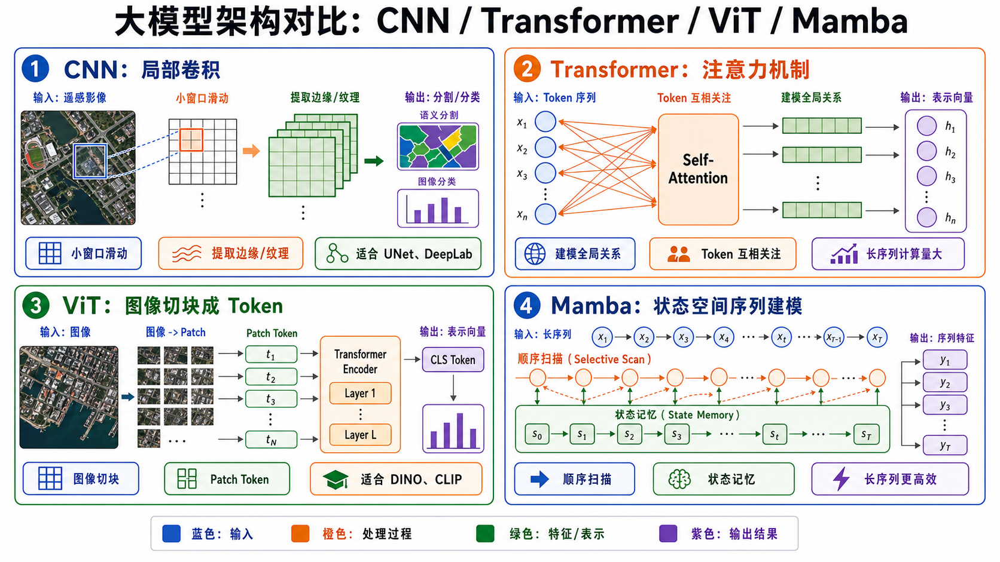
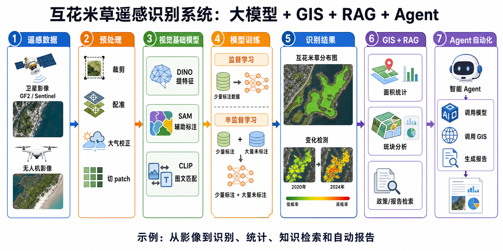

## 一、整体理解

可以先用一句话建立整体框架：

```text
大模型提供通用能力；
LLM 负责语言和推理；
视觉基础模型负责看图；
监督/半监督/自监督决定模型怎么学习；
预训练和微调决定模型怎么适配任务；
RAG 负责查知识；
Agent 负责调用工具完成复杂流程。
```

放到遥感项目里：

```text
视觉模型负责识别影像
LLM 负责解释结果和生成报告
RAG 负责查询规范、论文和历史资料
Agent 负责调用模型、GIS、数据库和脚本完成自动化流程
```

---

## 二、大模型是什么

大模型不是特指某一种模型，而是一类模型的统称。

它通常有三个特点：

```text
参数规模大
训练数据大
泛化能力强
```

可以把大模型理解成：

```text
先读过大量资料、看过大量图像、学过大量规律的通用模型。
```

典型例子：

```text
ChatGPT / Claude：学了大量文本，可以回答问题、写代码、总结文档
DINO：学了大量图像特征，可以作为视觉 backbone
SAM：学了大量分割数据，可以做通用分割
CLIP：学了图像和文字之间的关系，可以做图文匹配
```

在遥感中，大模型的价值是不用每个任务都从零训练。例如识别建筑物、道路、互花米草、养殖塘、垃圾堆，可以先用视觉基础模型提取通用特征，再用少量标注数据微调。

---

## 三、LLM 大语言模型是什么

LLM 是 Large Language Model，大语言模型。

它主要处理：

```text
文本
代码
表格描述
知识问答
任务规划
工具调用
```

典型代表：

```text
GPT
Claude
Gemini
LLaMA
Qwen
DeepSeek
```

LLM 的核心能力是理解和生成语言。它可以回答问题、写报告、总结论文、生成代码、解释模型结果、根据用户需求规划流程。

但 LLM 本身通常不擅长直接看遥感影像。它更像“大脑中的语言和推理模块”。

在遥感项目中，LLM 可以做：

```text
读取项目需求
解释识别结果
生成分析报告
查询规范文档
调用 GIS 工具
自动组织处理流程
```

---

## 四、视觉基础大模型

视觉基础大模型是专门处理图像或视觉信息的大模型。

它学习的是：

```text
边缘
纹理
形状
目标
区域
语义
图像和文字关系
```

### 1. DINO

DINO 是一种视觉自监督模型。它不依赖大量人工标签，而是让模型从图像本身学习特征。

可以理解为：

```text
DINO 学的是图像里哪些区域像同一类东西。
```

适合：

```text
特征提取
图像分类
遥感地物识别
少样本学习
聚类分析
变化检测 backbone
```

### 2. SAM

SAM 是 Segment Anything Model，通用图像分割模型。

它的特点是：

```text
给点、框或提示，它能分割出对应区域。
```

可以理解为通用抠图工具。它适合交互式标注、辅助生成 mask、快速分割目标轮廓、减少人工标注成本。

在遥感中，SAM 可以辅助标注建筑物、水体、裸地、垃圾堆等区域。但它不一定天然理解遥感专业类别，比如“互花米草”和“芦苇”可能需要额外适配。

### 3. CLIP

CLIP 是图文对齐模型。它同时学习图像和文字，让图像和文本进入同一个语义空间。

可以理解为：

```text
CLIP 知道一张图和一句话是否匹配。
```

适合：

```text
图文检索
零样本分类
多模态理解
遥感图像文本匹配
```

### 4. DINO、SAM、CLIP 的区别

| 模型 | 主要能力 | 输入 | 输出 | 遥感用途 |
|---|---|---|---|---|
| DINO | 学视觉特征 | 图像 | 特征向量/特征图 | 分类、检测、分割 backbone |
| SAM | 通用分割 | 图像 + 点/框/提示 | mask | 辅助标注、交互式分割 |
| CLIP | 图文对齐 | 图像 + 文本 | 相似度/特征 | 零样本分类、图文检索 |

简单说：

```text
DINO：视觉特征提取器
SAM：通用分割工具
CLIP：图像和文字翻译器
```

---

## 五、监督学习、半监督学习、自监督学习、无监督学习、强化学习

### 1. 监督学习

监督学习有明确标签。

```text
输入：遥感图像
标签：哪里是互花米草、哪里不是
```

适合分类、检测、语义分割、变化检测。优点是效果通常好，缺点是需要大量标注数据。

### 2. 半监督学习

半监督学习是一部分数据有标签，大量数据没标签。

```text
1000 张遥感图有标注
50000 张遥感图没标注
```

它适合遥感，因为遥感影像很多，但标注很贵。

### 3. 自监督学习

自监督学习不需要人工标签，模型从数据本身构造学习任务。

```text
遮住图像一部分，让模型预测
同一张图增强两次，让模型知道它们来自同一对象
```

DINO 就是典型自监督视觉模型。它适合大量无标注遥感影像预训练。

### 4. 无监督学习

无监督学习没有标签，直接发现数据结构。

```text
把遥感影像自动聚成几类
找出异常区域
做地物聚类
```

适合聚类、异常检测、探索性分析。

### 5. 强化学习

强化学习是模型通过“行动-奖励”学习策略。

```text
智能体选择某个区域采样
如果提高识别精度，就获得奖励
```

在大模型中，RLHF 就是用人类反馈强化模型回答质量。强化学习适合决策、路径规划、自动采样、机器人控制、智能体任务规划。

### 6. 学习方式对比

| 学习方式 | 是否需要标签 | 核心思想 | 适合任务 |
|---|---|---|---|
| 监督学习 | 需要 | 用标注数据学映射 | 分类、检测、分割 |
| 半监督学习 | 少量需要 | 有标签 + 无标签一起用 | 遥感少标注任务 |
| 自监督学习 | 不需要人工标签 | 从数据本身构造任务 | 大规模预训练 |
| 无监督学习 | 不需要 | 自动发现结构 | 聚类、异常检测 |
| 强化学习 | 需要奖励 | 试错学习策略 | 决策、Agent、控制 |

---

## 六、预训练、微调、迁移学习

### 1. 预训练

预训练是先在大规模数据上训练模型，让它学通用能力。

```text
DINO 在大量图像上预训练
LLM 在大量文本上预训练
```

### 2. 微调

微调是在具体任务数据上继续训练模型。

```text
用 GF2 互花米草标注数据微调 DINO backbone + 分割头
```

### 3. 迁移学习

迁移学习是把一个任务中学到的知识迁移到另一个任务。

```text
ImageNet 学到的边缘、纹理、形状知识
迁移到遥感建筑物识别
```

三者关系：

```text
预训练：先学通用知识
微调：适配具体任务
迁移学习：把已有知识迁移到新任务
```

大模型通常先预训练再微调，因为从零训练成本太高，而预训练模型已经学到通用能力，微调只需要少量任务数据。

---

## 七、RAG 技术

RAG 是 Retrieval-Augmented Generation，检索增强生成。

流程：

```text
用户提问
系统先去知识库检索相关资料
把检索结果交给 LLM
LLM 根据资料生成回答
```

RAG 和微调的区别：

| 方法 | 改不改模型参数 | 适合解决什么 |
|---|---|---|
| 微调 | 改 | 让模型学会特定风格、任务、分类标准 |
| RAG | 不改 | 让模型查最新资料、引用外部知识 |

通俗理解：

```text
微调：让模型重新学习
RAG：让模型开卷考试
```

遥感项目中，RAG 适合查询项目规范、检索历史报告、读取地物分类标准、引用治理政策、回答专业知识问题。

---

## 八、Agent 智能体

Agent 是能使用工具完成任务的智能体。

```text
普通 LLM：主要是回答问题
RAG：先检索资料再回答
Agent：会规划步骤、调用工具、检查结果
```

例如让 Agent 分析某区域互花米草扩张情况并生成报告，它可能会自动执行：

```text
1. 调用 GIS 工具读取影像
2. 调用分割模型识别互花米草
3. 调用 Python 统计面积
4. 调用数据库查询历史年份
5. 调用绘图工具生成变化图
6. 调用 LLM 写报告
```

区别：

| 类型 | 能力 |
|---|---|
| LLM | 语言理解和生成 |
| RAG | LLM + 知识库检索 |
| Agent | LLM + 规划 + 工具调用 + 多步执行 |

---

## 九、大模型架构

架构就是模型内部处理信息的方式。

下面这张图整体对比 CNN、Transformer、ViT 和 Mamba 的基本处理流程：



### 1. CNN

CNN 是卷积神经网络。

核心思想：

```text
用卷积核扫描图像，提取局部纹理和边缘。
```

CNN 可以理解为“用一个小窗口在图像上滑动观察”。它先看局部纹理，再逐层组合成更大的结构。

适合：

```text
图像分类
目标检测
语义分割
遥感地物识别
```

优点是高效、稳定。缺点是全局关系建模较弱。

### 2. Transformer

Transformer 最初用于语言模型，核心是注意力机制。

它能判断：

```text
哪些 token 和哪些 token 关系更重要。
```

Transformer 可以理解为“让每个词或图像块都去看其他位置，并判断谁和自己关系最大”。

在 LLM 中，token 是文字片段。在 ViT 中，token 是图像 patch。

优点是全局建模强。缺点是计算量随 token 数增加很快。

### 3. ViT

ViT 是 Vision Transformer。

它把图像切成小块：

```text
图像 -> patch -> token -> Transformer
```

ViT 可以理解为“先把图像切成很多小方块，再把每个小方块当成一个 token 交给 Transformer 处理”。

适合大规模预训练和视觉基础模型。DINO、CLIP 的视觉部分常用 ViT 结构。

### 4. Mamba

Mamba 是一种基于状态空间模型的架构，目标是更高效地处理长序列。

相比 Transformer：

```text
Transformer：注意力机制，全局关系强，但长序列成本高
Mamba：序列建模更高效，长序列更省
```

Mamba 可以理解为“模型按顺序扫描信息，并用一个内部状态记住前面看过的关键内容”。它不像 Transformer 那样让所有 token 两两互看，因此处理长序列时更省。

在遥感中，Mamba 类模型可能适合处理：

```text
长时间序列遥感数据
大幅面图像序列
高光谱长序列
```

### 5. 架构对比

| 架构 | 核心思想 | 优点 | 短板 | 遥感用途 |
|---|---|---|---|---|
| CNN | 局部卷积 | 高效稳定 | 全局建模弱 | UNet、DeepLab |
| Transformer | 注意力机制 | 全局关系强 | 计算量大 | LLM、ViT |
| ViT | 图像切 patch | 适合大规模预训练 | 大图成本高 | DINO、CLIP |
| Mamba | 状态空间序列建模 | 长序列高效 | 生态较新 | 时序遥感、高光谱 |

---

## 十、Claude、Claude Code、Codex 属于什么

### 1. Claude

Claude 是 Anthropic 做的大语言模型 LLM。

它和 ChatGPT、Gemini、Qwen、DeepSeek 类似，核心能力是：

```text
理解语言
生成文本
总结文档
写代码
推理分析
多轮对话
处理长上下文
```

所以 Claude 属于大模型、LLM、通用对话模型，部分版本也属于多模态模型。

### 2. Claude Code

Claude Code 更准确地说属于：

```text
编程智能体 / Coding Agent
```

它不是单纯的 Claude 聊天模型，而是把 Claude 模型接到开发环境里，让它可以读取代码库、搜索文件、修改代码、运行命令、执行测试、解释报错、提交改动、协助重构。

结构可以理解为：

```text
Claude LLM + 代码工具 + 终端 + 文件系统 + Git = Claude Code
```

### 3. Codex

Codex 有两层含义。

早期 OpenAI Codex 是一个代码大模型，主要用于代码补全、代码生成、解释代码、修复 bug、把自然语言变成代码。

现在的 Codex 编程助手更接近：

```text
LLM + 工具调用 + 文件读写 + 终端执行 + 代码修改 + 测试验证
```

所以它属于编程 Agent 或代码任务智能体。

### 4. 对比

| 名称 | 属于什么 | 主要能力 | 例子 |
|---|---|---|---|
| Claude | LLM | 对话、写作、总结、代码、推理 | 写报告、读论文、分析方案 |
| Claude Code | 编程 Agent | 读代码、改代码、跑测试 | 改训练脚本、修 bug |
| Codex 模型 | 代码 LLM | 生成和理解代码 | 写 Python、解释代码 |
| Codex 编程助手 | 编程 Agent | 调用工具完成编程任务 | 读文件、改代码、运行测试 |
| RAG 系统 | LLM + 检索 | 查资料后回答 | 查项目文档、查论文库 |
| Agent | LLM + 工具 + 规划 | 自动完成多步任务 | 自动跑遥感处理流程 |

---

## 十一、完整例子：互花米草遥感识别系统

下面这张图把视觉基础模型、监督/半监督学习、GIS、RAG 和 Agent 串成一个完整项目流程：



可以把系统分成几层：

```text
1. 数据层：
   GF2、Sentinel、无人机影像。

2. 预处理层：
   大气校正、裁剪、配准、切 patch。

3. 视觉基础模型层：
   DINO 提取特征，SAM 辅助标注，CLIP 做图文检索或零样本筛选。

4. 训练层：
   用监督学习训练分割模型，用半监督学习利用大量未标注影像。

5. 推理层：
   输出互花米草分布图、概率图、变化图。

6. GIS 分析层：
   统计面积、斑块、行政区汇总、年份变化。

7. RAG 知识层：
   检索治理政策、历史报告、分类标准、论文资料。

8. LLM 报告层：
   解释结果、生成分析报告、提出治理建议。

9. Agent 自动化层：
   调用模型、GIS、数据库、绘图工具和报告生成工具，串联完整流程。
```

实际工作流：

```text
1. 收集 GF2 和 Sentinel 影像
2. 做大气校正、裁剪、配准、切片
3. 用 SAM 辅助标注互花米草样本
4. 用 DINO 或 ViT backbone 提取视觉特征
5. 用少量标注数据训练分割模型
6. 用半监督方法加入未标注影像
7. 输出互花米草分布图
8. 用 GIS 统计各区域面积变化
9. 用 RAG 检索政策和历史治理记录
10. 用 LLM 自动生成分析报告
11. 用 Agent 串联整个流程，实现自动化
```

---

## 十二、总表总结

| 概念 | 是什么 | 主要作用 | 和其他概念区别 | 应用场景 |
|---|---|---|---|---|
| 大模型 | 大数据、大参数训练出的通用模型 | 提供通用能力 | 总称，不限文本或图像 | LLM、DINO、SAM、CLIP |
| LLM | 大语言模型 | 理解和生成文本 | 主要处理语言 | 问答、报告、代码、Agent |
| DINO | 自监督视觉模型 | 提取图像特征 | 不直接做分割，需要下游头 | 遥感分类、分割 backbone |
| SAM | 通用分割模型 | 根据提示生成 mask | 强在分割轮廓 | 辅助标注、交互分割 |
| CLIP | 图文对齐模型 | 图像和文字匹配 | 强在跨模态理解 | 图文检索、零样本分类 |
| 监督学习 | 有标签训练 | 精准学习任务 | 依赖标注 | 分类、检测、分割 |
| 半监督学习 | 少量标签 + 大量无标签 | 降低标注成本 | 比监督更省标签 | 遥感少样本任务 |
| 自监督学习 | 从数据本身构造任务 | 学通用特征 | 不需人工标签 | 大规模预训练 |
| 无监督学习 | 无标签发现结构 | 聚类、异常检测 | 不需要明确任务标签 | 地物聚类、异常区 |
| 强化学习 | 通过奖励学习策略 | 决策和规划 | 学行动策略 | Agent、路径规划 |
| 预训练 | 先学通用知识 | 提供基础能力 | 发生在微调前 | 大模型训练 |
| 微调 | 针对任务继续训练 | 适配具体任务 | 会改模型参数 | 互花米草识别 |
| 迁移学习 | 迁移已有知识 | 减少训练成本 | 思想更广 | ImageNet 到遥感 |
| RAG | 检索增强生成 | 查资料再回答 | 不改模型参数 | 政策问答、报告引用 |
| Agent | 会调用工具的智能体 | 完成复杂任务 | 比 LLM 多了行动能力 | 自动遥感分析流程 |
| CNN | 卷积架构 | 提取局部特征 | 高效但全局弱 | UNet、DeepLab |
| Transformer | 注意力架构 | 建模全局关系 | 强但计算重 | LLM、ViT |
| ViT | 图像 Transformer | 图像 patch 建模 | 适合视觉预训练 | DINO、CLIP |
| Mamba | 状态空间架构 | 高效长序列建模 | 生态较新 | 时序遥感、高光谱 |
| Claude | 通用 LLM | 文本、推理、写作、代码 | 主要是模型/对话助手 | 论文总结、报告写作 |
| Claude Code | 编程 Agent | 读代码、改代码、跑命令 | Claude 接入开发环境 | 项目代码维护 |
| Codex | 代码模型/编程 Agent | 写代码、改代码、运行测试 | 面向软件工程任务 | 训练代码、数据处理脚本 |

---

## 十三、一句话总结

```text
大模型是通用能力底座；
LLM 负责语言和推理；
视觉基础模型负责理解图像；
DINO、SAM、CLIP 分别偏特征、分割和图文对齐；
监督/半监督/自监督等方法决定模型如何学习；
预训练让模型先学通用知识，微调让模型适配具体任务；
RAG 让模型查资料后回答；
Agent 让模型调用工具完成复杂任务；
Claude 是通用 LLM，Claude Code 和 Codex 是面向代码工作的 Agent。
```
