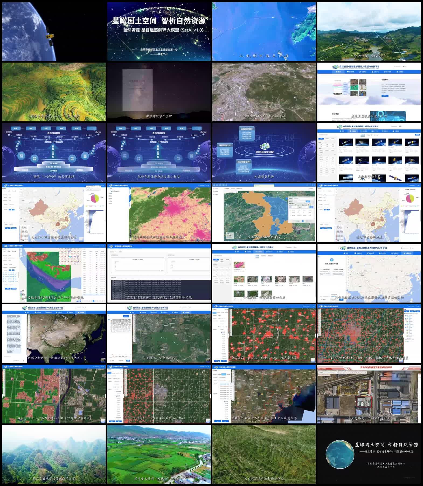

## 一、视频基本信息


```

本分析按每 10 秒抽取一个关键帧，共 32 帧。这里的“逐帧”不是逐视频原始帧，而是逐关键帧分析，适合理解视频展示的系统结构和功能逻辑。

总体判断

这个视频展示的不是一个孤立的大模型，而是一个完整的遥感智能解译平台。

更准确的定位是：


遥感解译大模型 + 多个垂直任务模型 + 数据资源管理 + 样本标注系统 + 模型训练/推理 + GIS 分析评价 + 工作流编排 + AI 智能体
```
关键帧总览：

也就是说，它更像：

```text
以遥感大模型为核心的自然资源智能分析平台
```

而不是：

```text
单独一个模型文件
```

从画面内容看，平台至少包含这些层：

```text
1. 数据层：遥感影像、ARD 数据、DSM、样本库等
2. 模型层：遥感解译大模型、垂直任务小模型、智能解译模型
3. 标注层：在线样本采集、人工交互、半自动/自动标注
4. 推理层：地物分类、目标检测、变化检测、自动提取
5. 分析层：GIS 空间统计、面积统计、专题评价、时序对比
6. 编排层：工作流构建、任务调度、串联数据处理和分析评价
7. 智能体层：面向业务需求的问答、决策支持和工具调用
```

---

## 二、逐关键帧分析

| 帧号 | 约时间 | 画面内容 | 展示的能力 | 判断 |
|---:|---:|---|---|---|
| 1 | 00:00 | 卫星绕地球飞行，展示遥感观测场景。 | 卫星遥感、国土空间观测入口。 | 宣传开场，强调数据来源是卫星遥感。 |
| 2 | 00:10 | 标题页：“星瞰国土空间，智析自然资源”，“自然资源·星智遥感解译大模型 SatAI v1.0”。 | 明确产品名称和定位。 | 视频宣称核心是“遥感解译大模型”。 |
| 3 | 00:20 | 海岸、海洋、岛屿等自然资源画面。 | 山水林田湖草沙等自然资源监测对象。 | 强调应用对象是自然资源全要素。 |
| 4 | 00:30 | 村镇、田地、山地上叠加网络连接线。 | 多源数据互联、空间信息联动。 | 表达平台化、网络化管理，不是单模型。 |
| 5 | 00:40 | 梯田、山地、水系等生态场景。 | 自然资源监管、生态环境监测。 | 展示遥感 AI 在自然资源业务中的应用背景。 |
| 6 | 00:50 | 暗色背景中出现治理相关画面。 | 自然资源数字化治理、现代化治理。 | 说明平台面向业务治理，不只是算法演示。 |
| 7 | 01:00 | 城市/山地区域遥感视角，字幕提到地理空间 AI 技术。 | 地理空间 AI、遥感智能处理。 | 将遥感、地理空间和人工智能结合。 |
| 8 | 01:10 | 平台首页，顶部菜单包括数据资源、智能解译、分析评价、场景应用、AI 智能体。 | Web 平台门户和功能模块。 | 这是综合平台证据，不是单一模型界面。 |
| 9 | 01:20 | 技术体系架构图，出现“1+M+N”体系、ARD 数据、GPU 集群等。 | 大模型底座、领域模型、应用体系。 | 说明它可能是“大模型 + 多任务模型 + 应用”的架构。 |
| 10 | 01:30 | 继续展示“1+M+N”，强调多个自然资源领域应用小模型。 | 多个业务小模型和应用模型。 | 明确不是只有一个模型，存在多模型组合。 |
| 11 | 01:40 | “星智遥感大模型”中心图，周围有海量高精样本、业务需求引导、多类型 API、智能体动态构建、先进模型架构、垂直模型、知识融合等。 | 大模型核心能力、样本体系、API、智能体、知识融合。 | 这是平台的核心架构说明：大模型是核心，但周边组件很多。 |
| 12 | 01:50 | 数据资源页面，展示卫星影像、数据产品、样本集等卡片。 | 遥感数据资源管理。 | 平台有数据管理层，支持模型训练和应用。 |
| 13 | 02:00 | 地图统计界面，显示区域分布和统计图表。 | 空间统计、自然资源分析评价。 | GIS 分析功能，不属于单纯模型能力。 |
| 14 | 02:10 | 遥感影像上叠加粉色/黄色专题结果。 | 专题解译、区域监测、地物分类或异常识别。 | 模型推理结果叠加到地图上。 |
| 15 | 02:20 | 地图上展示蓝色和棕色多边形区域，右侧有操作窗口。 | 分类/分割结果、地块提取、结果编辑。 | 体现遥感解译模型和 GIS 交互结合。 |
| 16 | 02:30 | 再次展示区域统计和图表结果。 | 分析评价、统计汇总、专题制图。 | 平台把解译结果转化为业务统计。 |
| 17 | 02:40 | 样本管理界面，左侧分类，地图上有多类别彩色标注，右侧样本列表。 | 样本库管理、样本筛选、多类别地物样本。 | 这是训练数据管理能力，是平台的重要组成。 |
| 18 | 02:50 | 模型训练/在线推理相关页面，底部有日志或训练输出。 | 模型训练、性能评估、在线推理。 | 表示平台不只是用模型，也支持模型生产和管理。 |
| 19 | 03:00 | 数据或样本产品列表，显示多个遥感缩略图。 | 数据产品管理、样本集管理。 | 继续体现数据资产化和样本资产化。 |
| 20 | 03:10 | AI 智能体相关页面，地图和对话/配置区域并存。 | AI 智能体、问答、任务辅助。 | 说明平台引入 LLM/Agent 式交互，不只是视觉模型。 |
| 21 | 03:20 | 左侧长文本或知识内容，右侧遥感地图。 | 知识问答、分析评价、行业知识融合。 | 可能对应 RAG/知识库/业务问答能力。 |
| 22 | 03:30 | 地图上有自动化流程或任务结果，字幕提到自动化、智能化流程。 | 工作流自动化、智能流程调度。 | 接近 Agent 或低代码工作流编排能力。 |
| 23 | 03:40 | 大范围地图上出现大量红色识别框/斑块。 | 目标检测、专题目标提取。 | 像是建筑、矿山、风电、光伏等目标识别。 |
| 24 | 03:50 | 网格化影像上大量红色目标标记。 | 大范围批量检测、网格化识别。 | 展示规模化自动识别能力。 |
| 25 | 04:00 | 红绿等颜色分割结果覆盖城乡/农田区域。 | 语义分割、地类识别、城市/农田解译。 | 体现像素级或斑块级分类能力。 |
| 26 | 04:10 | 网格影像和红色检测结果，字幕提到分析评价能力。 | 检测结果统计、空间评价。 | 从模型识别走向评价分析。 |
| 27 | 04:20 | 海岸带或沿海区域地图，叠加识别结果。 | 海岸带监测、变化识别、国土空间规划。 | 遥感模型用于沿海自然资源业务。 |
| 28 | 04:30 | 青岛自然资源相关系统界面，建筑/用地等遥感画面。 | 地方业务系统集成、生态/文物/自然资源监管。 | 平台可能已接入地方行业应用。 |
| 29 | 04:40 | 山地、河流、森林自然景观。 | 生态环境监测、山水林田湖草治理。 | 宣传性场景，强调生态保护价值。 |
| 30 | 04:50 | 村镇农田航拍画面。 | 高质量支撑自然资源管理和乡村应用。 | 展示农业、乡村、国土空间管理场景。 |
| 31 | 05:00 | 草地/植被遥感画面，字幕提到自然资源行业智能化。 | 行业智能化、地表覆盖监测。 | 宣传总结，强调行业落地。 |
| 32 | 05:10 | 片尾标题：“星瞰国土空间，智析自然资源”。 | 产品收束和品牌总结。 | 结束页，回到平台定位。 |

---

## 三、视频展示的系统架构推断

根据画面内容，可以推断平台大概是下面这种结构：

```text
遥感数据资源
    ↓
样本采集与样本库管理
    ↓
遥感解译大模型 / 视觉基础模型
    ↓
多个垂直任务模型
    ↓
智能解译结果
    ↓
GIS 分析评价
    ↓
工作流编排 / API 服务 / AI 智能体
    ↓
自然资源业务应用
```

其中“大模型”可能承担的是：

```text
通用遥感特征提取
多任务迁移能力
少样本适配能力
跨区域/跨场景泛化能力
为多个下游任务模型提供基础表征
```

“多个小模型”可能承担的是：

```text
水体提取
建筑物提取
耕地识别
林草识别
道路提取
变化检测
违法用地识别
生态环境监测
```

“平台”承担的是：

```text
数据管理
样本管理
模型训练
模型推理
成果展示
统计分析
业务流程编排
API 服务
智能体交互
```

---

## 四、它到底是大模型，还是多个小模型平台

最准确的说法：

```text
它是一个遥感大模型驱动的综合分析平台。
```

不能简单说它只是一个大模型，也不能简单说它只是多个小模型。

从视频看，它更接近：

```text
一个遥感基础大模型作为底座
+ 多个自然资源垂直任务模型
+ 数据和样本管理系统
+ GIS 分析工具
+ 工作流编排系统
+ AI 智能体
```

如果底层真的有一个统一的遥感基础模型，那么它可以叫：

```text
遥感大模型平台
```

如果底层只是多个独立任务模型拼在一起，没有统一预训练大模型，那么更准确应该叫：

```text
遥感智能解译平台
```

仅凭视频，无法最终确认它底层模型是否满足严格的大模型定义。还需要看技术资料。

---

## 五、判断是否是真正遥感大模型，需要看哪些资料

如果后续想判断这个平台是不是真正的大模型，可以要求对方提供：

```text
1. 模型参数量
2. 预训练数据规模
3. 是否使用海量无标注遥感影像自监督预训练
4. 是否支持多传感器、多区域、多任务泛化
5. 是否有统一 backbone
6. 下游任务是否通过任务头、提示、微调适配
7. 是否支持少样本或零样本解译
8. 与传统小模型相比的精度提升和泛化测试
9. 推理速度、显存需求和部署方式
10. 是否支持 API、工作流和智能体调用
```

尤其要重点问：

```text
它是一个统一遥感基础模型，还是很多任务模型的集合？
```

这个问题决定它到底是“大模型平台”，还是“多模型平台”。

---

## 六、和我们前面大模型概念的对应关系

| 视频中展示的内容 | 对应概念 | 说明 |
|---|---|---|
| 星智遥感大模型 | 视觉基础模型 / 遥感基础模型 | 可能是遥感图像特征和多任务解译的底座 |
| 样本采集、样本库 | 监督学习 / 半监督学习 | 用于训练和更新垂直任务模型 |
| 海量高精样本 | 数据工程 | 大模型和小模型都依赖高质量样本 |
| 多个自然资源应用小模型 | 垂直任务模型 | 面向水体、建筑、耕地、林草等具体任务 |
| 智能解译 | 图像识别 / 语义分割 / 目标检测 | 遥感 AI 的核心输出 |
| 分析评价 | GIS 分析 | 面积统计、变化分析、空间评价 |
| 知识融合、业务问答 | RAG / 知识库 | 把自然资源业务规则和文档接入系统 |
| AI 智能体 | Agent | 自动调用数据、模型、GIS 和报告工具 |
| 工作流构建 | 工具编排 | 将处理、分析、评价串成完整流程 |

---

## 七、结论

这个视频展示的系统可以理解为：

```text
遥感大模型 + 自然资源业务小模型 + GIS 分析平台 + 工作流 + 智能体
```

它的重点不是单一算法，而是把遥感影像、样本、模型、分析、业务流程和智能体整合成一个平台。

对我们自己的遥感项目有几个启发：

```text
1. 不能只关注模型本身，还要建设数据、样本、推理、GIS 分析和报告流程。

2. 遥感大模型更适合作为基础能力，下游仍然需要任务模型和业务规则。

3. 真正可用的平台往往是“大模型 + 小模型 + 工具链 + 工作流”的组合。

4. Agent 的价值在于自动调用工具，而不是替代所有模型。

5. 如果做互花米草、垃圾识别、地类变化检测，也可以按类似架构设计：
   数据管理 -> 样本标注 -> 模型训练 -> 智能解译 -> GIS 统计 -> RAG/Agent 报告。
```

一句话总结：

```text
这不是单纯的大模型演示，而是一个以遥感解译大模型为核心的自然资源智能分析平台。
```
