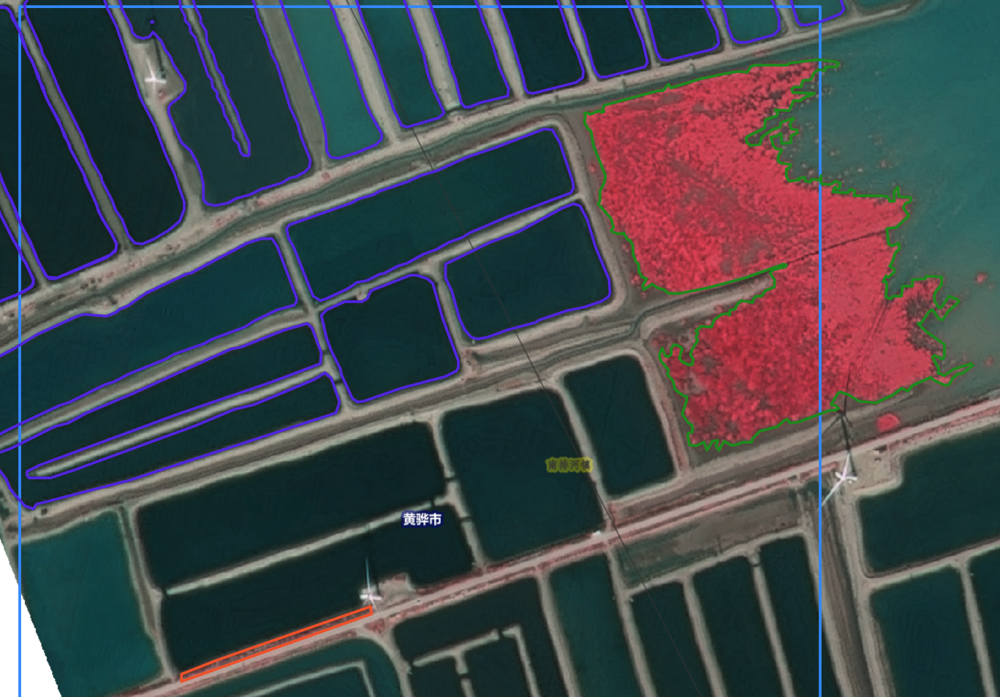
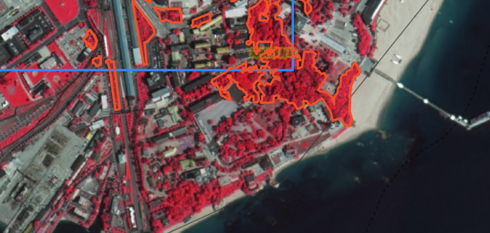

## 一、标注目标

本次标注用于后续遥感影像语义分割模型训练，主要标注三类地物：

1. **养殖塘口**
2. **互花米草**
3. **盐沼植被**

所有人必须按照统一标准标注，避免不同人画法不一致，影响后续模型训练效果。


---

## 二、类别说明与标注要求

### 1. 养殖塘口

**标注颜色：蓝色**  
**类别名称：养殖塘口**  
**英文建议：`aquaculture_pond`**

#### 判读特征

养殖塘口一般是人工修建的水产养殖池塘，通常具有以下特点：

- 形状比较规则，多为矩形、长条形或规则多边形；
- 多个塘口常成片、成排分布；
- 塘口之间有塘埂、道路或分隔线；
- 内部多为水面，颜色较暗或较均匀；
- 边界比较清楚，有明显人工修建痕迹。

#### 标注要求

本次建议**只标注养殖塘水面区域**。

标注时注意：

1. 沿塘口水面边界画多边形；
2. 一个独立塘口单独标注；
3. 有塘埂、道路分隔的塘口不要合并；
4. 不要把塘埂、道路、裸地、建筑圈进去；
5. 细长排水沟、水渠、自然河道不要标为养殖塘口；
6. 不确定是不是养殖塘的区域，先不标，后续统一确认。

#### 简单理解

> 规则人工池塘才标，主要标水面，不标塘埂和道路。

---

### 2. 互花米草

**标注颜色：绿色**  
**类别名称：互花米草**  
**英文建议：`spartina_alterniflora`**

#### 判读特征

互花米草一般分布在滨海潮滩、海岸边缘、水陆交错区域，常见特征包括：

- 多位于海岸线附近、潮滩、潮沟两侧或滩涂边缘；
- 在假彩色影像中通常表现为红色、深红色或亮红色植被斑块；
- 斑块形状不规则，可能呈片状、带状或沿岸扩展；
- 常靠近水体、潮沟、裸滩或盐沼区域；
- 与其他盐沼植被可能混杂，需要结合位置和形态判断。

#### 标注要求

1. 只标注明确能判断为互花米草的区域；
2. 沿植被主体斑块边界画多边形；
3. 不要把水体、裸地、道路、建筑圈进去；
4. 不要仅凭颜色偏红就标为互花米草；
5. 与盐沼植被混杂严重、无法判断的区域，先不标；
6. 小斑块如果特征明确，可以标；如果太小或不确定，不标。

#### 简单理解

> 互花米草必须是比较明确的滨海潮滩植被，不确定不要强行标。

---

### 3. 盐沼植被

**标注颜色：红色**  
**类别名称：盐沼植被**  
**英文建议：`saltmarsh_vegetation`**

#### 判读特征

盐沼植被是滨海湿地中的自然植被，不包括城市绿化和普通树木。

一般具有以下特点：

- 位于滨海湿地、潮滩、河口、海岸边缘等区域；
- 在假彩色影像中多表现为红色、深红色或粉红色；
- 形状自然、不规则；
- 常沿海岸、水体、潮沟或低洼湿地区域分布；
- 纹理较自然，不像建筑、道路那样规则。

#### 标注要求

1. 只标注滨海湿地环境中的自然植被；
2. 沿植被主体边界画多边形；
3. 不要把水体、道路、建筑、裸地、厂区、堆场圈进去；
4. 城市绿化、道路绿化、厂区树木、村庄周边树木不要标为盐沼植被；
5. 红色屋顶、建筑阴影、裸露地表不要误标为盐沼植被；
6. 如果不确定是不是盐沼植被，先不标，后续统一确认。

#### 简单理解

> 只标滨海湿地自然植被，不标城市绿化、道路绿化和普通树木。

---

## 三、破碎边界和小斑块怎么画

互花米草和盐沼植被边界经常比较破碎，标注时不要过度抠细节。

### 1. 总体原则

> 画主体，不抠碎；边界可平滑；明显错误要避开；不确定不强画。

也就是说，标注要贴合地物主体边界，但不需要把每一个小毛刺、小锯齿、小缺口都画出来。

---

### 2. 边界有很多锯齿怎么办

如果边缘有很多小锯齿、小凹凸，可以适当平滑。

推荐做法：

- 沿主体外轮廓画；
- 小毛刺、小凹凸可以忽略；
- 不要把边界画得特别碎；
- 不需要逐像素抠边。

不推荐做法：

- 每个小缺口都抠出来；
- 把一个完整斑块画成很多碎块；
- 用特别复杂的锯齿边界。

---

### 3. 小碎斑怎么处理

#### 可以合并的情况

如果小斑块紧贴主体，并且颜色、纹理一致，中间没有明显道路、水体或建筑隔断，可以和主体一起标。

#### 不建议标注的情况

以下小斑块一般不标：

- 面积很小；
- 非常零散；
- 边界模糊；
- 类别不确定；
- 孤立的小红点、小碎块。

简单理解：

> 靠近主体、明显同类的可以合并；孤立、模糊、不确定的小碎斑不标。

---

### 4. 内部小空洞怎么处理

有些植被内部会有小缝隙、小阴影、小裸地或小暗斑。

#### 可以不抠除

以下情况可以直接包含在植被区域内：

- 很小的裸地缝隙；
- 很窄的纹理变化；
- 小阴影；
- 小暗斑；
- 边界不清的小空洞。

#### 必须避开或抠除

以下情况必须避开：

- 明显水体；
- 明显道路；
- 明显建筑；
- 明显裸地；
- 大面积空地；
- 厂区、堆场、硬化地面。

简单理解：

> 小噪声可以忽略，大的非目标区域必须去掉。

---

## 四、统一标注原则

### 1. 宁可少画，不要乱画

不确定的区域不要强行标注。  
错误标注比漏标更影响模型训练。

---

### 2. 沿真实边界画多边形

所有类别都要用多边形沿地物边界勾画，不要用大矩形粗框。

尤其是互花米草和盐沼植被，要按照自然斑块边界画。

---

### 3. 不同类别不要重叠

同一个区域只能属于一个类别。

如果互花米草和盐沼植被相邻，要尽量分开。  
如果边界判断不清，就先不标，后续确认。

---

### 4. 不要把非目标地物圈进去

以下对象一般都不要标入目标类别：

- 道路；
- 建筑；
- 裸地；
- 水体；
- 堤坝；
- 厂区；
- 城市绿化；
- 道路绿化；
- 红色屋顶；
- 建筑阴影。

---

## 五、容易出错的地方

### 1. 养殖塘口容易错标为

- 排水沟；
- 自然河道；
- 潮沟；
- 道路边积水；
- 普通水面；
- 塘埂和道路。

判断标准：

> 有明显人工池塘形态的才标为养殖塘口。

---

### 2. 互花米草容易错标为

- 普通盐沼植被；
- 水边杂草；
- 道路边绿化；
- 颜色偏红的普通植被；
- 不确定的混合植被。

判断标准：

> 不能只看颜色，要结合是否位于滨海潮滩、水陆交错区。

---

### 3. 盐沼植被容易错标为

- 城市绿化；
- 道路绿化带；
- 厂区树木；
- 村庄周边植被；
- 红色屋顶；
- 建筑阴影；
- 裸地和堆场。

判断标准：

> 盐沼植被必须是滨海湿地自然植被，不是所有红色植被都算。
> 



---

## 六、待确认区域处理

遇到以下情况，不要直接标注：

1. 类别不确定；
2. 互花米草和盐沼植被混杂严重；
3. 边界太模糊；
4. 影像颜色异常；
5. 道路边狭长植被带；
6. 港区、厂区、村庄附近绿化；
7. 不确定是不是养殖塘的细长水体。

处理方式：

1. 暂不标注；
2. 截图保存；
3. 标明疑问类别；
4. 统一交给负责人确认。

命名示例：

```text
uncertain_影像编号_疑似互花米草.png
uncertain_影像编号_疑似盐沼植被.png
uncertain_影像编号_疑似养殖塘口.png